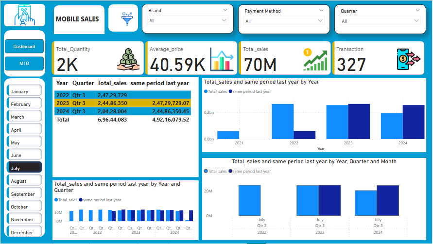
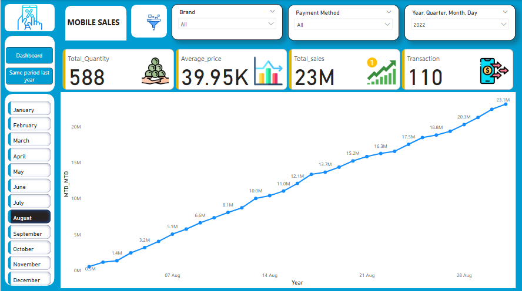

📊 Mobile Sales Power BI Dashboard
This project presents a set of interactive Power BI dashboards designed to track and analyze mobile sales performance using various KPIs, filters, and visualizations.

🔧 Features
✅ Interactive filters for:

Brand

Payment Method

Quarter, Month, and Year

Mobile Model

✅ Key Performance Indicators (KPIs):

Total Quantity Sold

Average Price

Total Sales (in millions)

Total Transactions

✅ Hierarchical Time-Based Analysis:

Year → Quarter → Month → Day drill-down

Same period comparison with previous year

✅ Visualizations Used:

Line charts for time-series sales tracking

Matrix visual for year-quarter summary

Bar and Pie charts for breakdown by:

Mobile model

Payment method

Customer ratings

📅 Dashboards Included
Monthly Performance Dashboard

Highlights performance by quarter and year

Compare total sales with the same period last year

Interactive breakdown by filters

Same Period Last Year Analysis

Tracks daily sales trends

Focused on a selected year, month, or day

Great for growth or seasonality analysis

MTD (Month-to-Date) Dashboard

Shows performance across all months

Includes customer ratings and payment methods

Compares mobile model performance

📌 How to Use
Open the .pbix file in Power BI Desktop.

Use slicers (filters) to explore different segments.

View insights on mobile sales trends and patterns.

📷 Sample Screenshots

